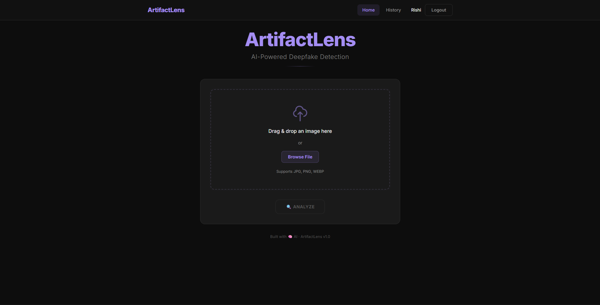
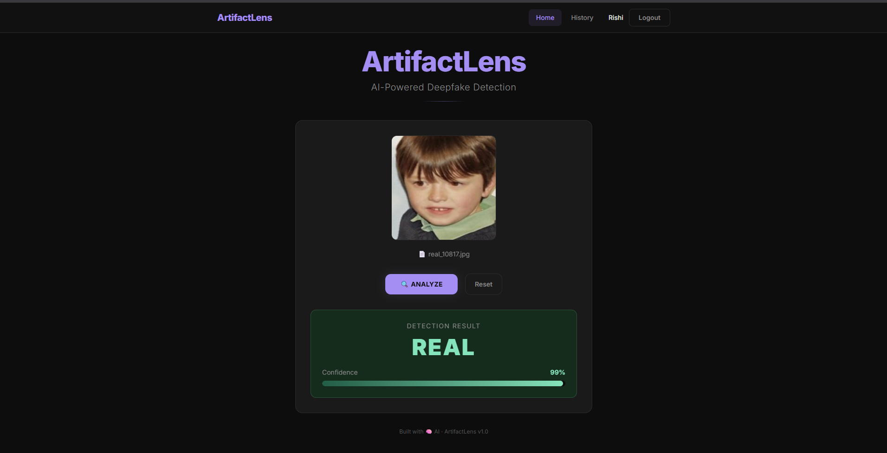
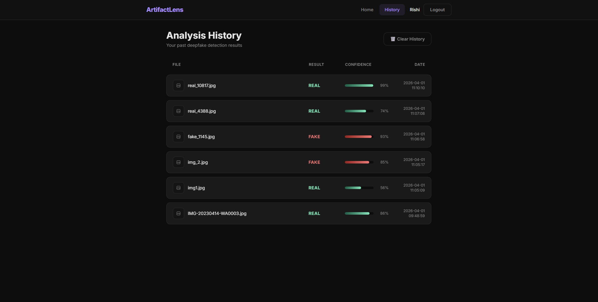
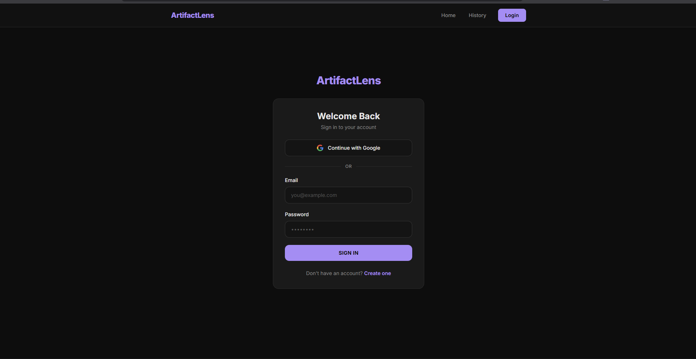

# ArtifactLens — AI-Powered Deepfake Detection

<div align="center">

**A full-stack forensic portal that detects AI-generated face images using deep learning.**

[](https://artifact-lens-six.vercel.app)
[](https://github.com/Corerishi/ArtifactLens)


</div>

---

## 📸 Screenshots

<div align="center">

### Upload & Analyze


### Detection Result


### Analysis History


### Authentication


</div>

---

## What is ArtifactLens?

ArtifactLens is a centralized forensic portal that detects AI-generated (deepfake) face images using deep learning. Upload any face image — the system detects the face, geometrically aligns it using MTCNN, runs it through a fine-tuned ResNet50 model, and returns whether the image is **Real or Fake** with a scientific confidence score.

---

## Features

- 🎯 **82.99% Model Accuracy** — fine-tuned ResNet50 with class-weighted loss
- 🧬 **MTCNN Face Alignment** — geometric normalization before inference
- 🔐 **JWT Authentication** — secure register/login with bcrypt hashing
- 📜 **Forensic Audit Trail** — every scan saved to MongoDB Atlas
- ⚡ **Async Backend** — FastAPI + Motor for non-blocking performance
- 🌑 **Dark UI** — React 18 + Tailwind CSS with cybersecurity aesthetic
- 🚀 **Fully Deployed** — live on Vercel + HuggingFace Spaces

---

## System Architecture
```
User Uploads Image (React Frontend)
            ↓
FastAPI receives image at /api/predict
            ↓
MTCNN detects face + calculates eye angle
            ↓
Affine transformation → aligned 224×224 face
            ↓
ResNet50 model inference → confidence score
            ↓
Result saved to MongoDB Atlas
            ↓
Real / Fake + Confidence displayed on frontend
```

---

## Model Details

| Property | Details |
|---|---|
| Base Architecture | ResNet50 (pretrained on ImageNet) |
| Training Dataset | 110,911 images (Real + GAN-generated Fake) |
| Training Hardware | NVIDIA RTX A6000 (48GB VRAM) |
| Technique | Transfer Learning + Class-Weighted Fine-tuning |
| Preprocessing | MTCNN face alignment to 224×224 |

### Version Comparison

| Version | Overall Accuracy | Real Detection | Fake Detection |
|---|---|---|---|
| v1 (Baseline) | 73.24% | ~65% | ~87% |
| **v2 (Production)** | **82.99%** | **87.25%** | **78.74%** |

> **Key insight:** V2 introduced class-weighted training — one technique, zero architecture changes, +9.75% accuracy improvement.

---

## 🛠️ Tech Stack

| Layer | Technology |
|---|---|
| Frontend | React 18, Vite, Tailwind CSS, Axios, React Router |
| Backend | FastAPI, Python 3.11, Uvicorn |
| AI/ML | TensorFlow 2.20, tf-keras, ResNet50, MTCNN, OpenCV |
| Database | MongoDB Atlas, Motor (async driver) |
| Auth | JWT (python-jose), bcrypt (passlib) |
| Deployment | Vercel (frontend), HuggingFace Spaces (backend) |

---

## Project Structure
```
ArtifactLens/
├── backend/
│   ├── main.py          ← FastAPI server, all API routes
│   ├── inference.py     ← MTCNN + ResNet50 inference pipeline
│   ├── database.py      ← MongoDB Atlas async connection
│   └── requirements.txt
├── frontend/
│   └── src/
│       ├── pages/
│       │   ├── Home.jsx      ← Upload + result display
│       │   ├── Login.jsx
│       │   ├── Register.jsx
│       │   └── History.jsx
│       └── components/
│           ├── Navbar.jsx
│           └── ProtectedRoute.jsx
└── assets/              ← Screenshots for README
```

---

## Running Locally

### Prerequisites
- Python 3.11+
- Node.js 18+
- MongoDB Atlas account (or local MongoDB)
- `artifact_lens_final.h5` model file

### Backend
```bash
cd backend
python -m venv .venv
.venv\Scripts\activate        # Windows
source .venv/bin/activate     # Mac/Linux
pip install -r requirements.txt

# Create .env file with:
# MONGO_URL=your_mongodb_connection_string
# JWT_SECRET=your_secret_key

# Place artifact_lens_final.h5 inside backend/models/
uvicorn main:app --reload
```

### Frontend
```bash
cd frontend
npm install

# Create .env.development with:
# VITE_API_URL=http://localhost:8000

npm run dev
```

### Access

| Service | URL |
|---|---|
| Frontend | http://localhost:5173 |
| Backend API | http://localhost:8000 |
| Swagger Docs | http://localhost:8000/docs |

---

## API Endpoints

| Method | Endpoint | Auth | Description |
|---|---|---|---|
| POST | `/api/auth/register` | No | Create account |
| POST | `/api/auth/login` | No | Login → JWT token |
| POST | `/api/predict` | No | Upload image → Real/Fake + confidence |
| GET | `/api/history` | No | Get analysis history |
| DELETE | `/api/history` | No | Clear history |

---

## 👤 Author

**Rishi Raj**
- GitHub: [@Corerishi](https://github.com/Corerishi)
- LinkedIn: [linkedin.com/in/rishiraj27](https://linkedin.com/in/rishiraj27)
- Live Project: [artifact-lens-six.vercel.app](https://artifact-lens-six.vercel.app)
